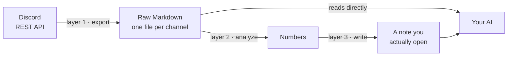

# Build Your Own Discord Brain

*Give an AI read access to your Discord history. No hosted bot, no server, no monthly cost. About 90 minutes start to finish, most of it waiting.*

---

## What you are building

A script pulls every message from your Discord server through the REST API and writes one Markdown file per channel onto your disk. Your AI assistant reads those files. That is the whole idea.

Three scripts, three jobs, kept separate:



| Layer | Job | Breaks when |
|---|---|---|
| 1 — Export | Pull messages, write raw Markdown | Token expires, API changes |
| 2 — Analyze | Count and cross-reference | Your naming convention changes |
| 3 — Write | Put results somewhere you read | You move your notes folder |

Keep them in separate files. Each one fails for a different reason, and a failed analysis should never cost you a good export.

**Layer 1 interprets nothing.** It copies. All meaning lives in layer 2. That way, changing your mind about what to measure never means re-downloading anything.

---

## Part 1: Discord setup (do this by hand, 10 minutes)

You cannot skip this or hand it to an AI. It is clicking on a website.

1. Go to **discord.com/developers/applications** and click **New Application**. Name it anything.

2. Open the **Bot** tab. Click **Reset Token**, then copy the token. You see it once. Paste it somewhere temporary.

3. Still on the **Bot** tab, scroll to **Privileged Gateway Intents** and turn on **MESSAGE CONTENT INTENT**. Save.

4. Open **OAuth2 → URL Generator**. Under Scopes check **bot**. Under Bot Permissions check **View Channels** and **Read Message History**, nothing else. Copy the URL at the bottom, open it in a browser, pick your server, authorize.

> ### The trap that costs two hours
>
> If you skip step 3, the API does not return an error. It returns author, timestamp and message ID, and leaves `content`, `embeds` and `attachments` **empty**. Your export produces files full of message headers with nothing under them, and you go hunting for a bug in your rendering code.
>
> General rule: when an API hands you blanks instead of an error, check a permission before you check your code.

You only need to be the server owner or an admin to invite the bot. If it is someone else's server, they have to run step 4.

---

## Part 2: Prompts to give Claude Code

Open a terminal in an empty folder and run `claude`. Then paste these in order. Each one builds on the last, so do not skip ahead.

### Prompt 1: the exporter

```
Build me a Python script called discord_export.py that exports every text
channel of a Discord server to local Markdown files, one file per channel.

Requirements:
- Use the Discord REST API v10 (https://discord.com/api/v10). Bot token auth.
- Standard library only. urllib, no requests, no discord.py. I want zero
  pip installs.
- Read the token from the DISCORD_BOT_TOKEN environment variable, falling
  back to a .env file sitting next to the script. Never hardcode it.
- Two commands:
    python discord_export.py list                  -> print servers and
                                                      channels the bot can see
    python discord_export.py export <guild_id>     -> export everything
    python discord_export.py export <guild_id> --since 2026-01-01

Handle these properly, they all happen in practice:
- Pagination: /channels/{id}/messages returns 100 messages max. Page backward
  with the `before` cursor until a batch comes back short. Reverse the final
  list so it reads oldest to newest.
- HTTP 429: read `retry_after` from the response body and sleep that long
  plus a small buffer. Do not guess a fixed delay.
- HTTP 403: the bot cannot see that channel. Skip it and keep going. One
  private channel must not kill an export of 1500 messages.
- HTTP 5xx: retry up to 5 times with growing delays.
- Sleep 0.4s between pages to stay polite.

File output:
- Sanitize channel names for the filesystem: keep alphanumerics, dash,
  underscore and space; replace everything else with a dash; lowercase.
  Channel names contain emoji and separators.
- Start every file with a header block: real channel name, server name,
  category name, message count, and the export timestamp. The export
  timestamp matters most, it is what stops anyone drawing conclusions from
  stale data.
- Render each message as: "### YYYY-MM-DD HH:MM — author", then content,
  then any embed titles/descriptions/fields, then attachment links.
- Write to export/<server-name>/<channel-name>.md, overwriting each run.

Also create a .gitignore containing .env, export/ and __pycache__/ before
anything else.
```

### Prompt 2: the analyzer

Only useful if you encode something in your channel names. Skip to Prompt 3 if you do not.

```
Now build trading_stats.py (rename it to fit my use case), a module that
reads the exported Markdown and produces numbers.

The key idea: I encode meaning in my channel names, so you do not need to
read message bodies. Read the FIRST LINE of each file only.

My convention is: <describe your own tags here, for example: a green or red
circle emoji for outcome, a green or red book emoji for whether I followed
my rules, and a date>

Requirements:
- Store emoji as escape sequences like "\U0001F7E2", never as literal emoji
  pasted into the source. Literals do not survive editors and encodings.
- Skip any file whose first line has no date in it. Those are summary
  channels, not sessions.
- Expose one compute() function returning every derived number. This module
  is the single source of truth. Every other script imports it instead of
  re-parsing files. Do not let a second script grow its own copy of this
  parsing logic.
- Count and report what you EXCLUDED. If 24 files had no tags, print that
  number next to the percentages. A statistic that hides its sample size is
  worse than no statistic.
```

### Prompt 3: writing results somewhere you read

```
Build sync_notes.py. It imports the analyzer's compute() and writes a single
Markdown note into <path to your notes folder / Obsidian vault>.

Hard rules:
- Write to a file whose name is clearly marked automatic, for example
  "Performance (auto).md". It must be a DIFFERENT file from anything I write
  by hand. A generated note never overwrites a human one.
- Put a warning callout at the top of the generated note saying it is
  auto-generated, naming the script that regenerates it, and linking to my
  hand-written note on the same topic.
- Include the sample-size caveats in the note itself, not just in the
  console output.
```

### Prompt 4: making it run by itself (Windows)

```
Set up nightly automation for this project on Windows. I want three files:

1. refresh.bat — the manual one. Runs export, then analysis, then the note
   sync. Prints progress. Ends with `pause` so the window stays open if a
   step fails.

2. refresh_auto.bat — the scheduled one. Same steps, everything redirected
   to refresh.log, no pause, proper exit codes. Set PYTHONUTF8=1 and
   PYTHONIOENCODING=utf-8 at the top: without them Python writes the log in
   cp1252 and crashes on the emoji in channel names. It works in a console
   and dies when redirected to a file, so it will not show up in testing.

3. refresh_silent.vbs — launches refresh_auto.bat with window style 0 so no
   console pops up on screen.

Then tell me the exact steps to register refresh_silent.vbs in Windows Task
Scheduler to run daily at 10pm.
```

On macOS or Linux, replace Prompt 4 with: *"Write a shell script that runs all three steps into a log file, and give me the exact crontab line to run it nightly at 10pm."*

---

## Part 3: commands you run yourself

```bash
python discord_export.py list
```

Run this first, always. It prints every server and channel the bot can see. If your server is not listed, the invite in Part 1 step 4 did not go through. If channels are missing, the bot lacks View Channels on them.

Copy the `guild_id` from the output, then:

```bash
python discord_export.py export <guild_id>
```

First run on a busy server takes a few minutes and will hit rate limits. That is normal, the script waits and continues.

**Now do the one check that matters.** Open any exported `.md` file and confirm there is actual text under the message headers. If you see headers with nothing beneath them, go back to Part 1 step 3. MESSAGE CONTENT INTENT is off.

To limit a re-export to recent history:

```bash
python discord_export.py export <guild_id> --since 2026-01-01
```

Then, once everything works:

```bash
refresh.bat
```

---

## Part 4: the one habit that makes this worth building

The export is only as good as what is in your Discord. The single highest-leverage thing you can do costs two seconds per day:

**Put structure in your channel names when you create them, not in a parser afterward.**

A channel called `#3🟢📗︳08-27-2026` carries the date, the outcome and whether you followed your process. Your analyzer reads one line per file and gets all three. Extracting the same facts from free-form text would need a language model and would still be wrong sometimes.

Two seconds of your attention beats a hundred lines of clever parsing. Pick your tags before you have a year of history, because renaming a year of channels is miserable.

---

## Part 5: security

1. **The token lives in `.env`**, never in code, never in a `.bat`, never in a screenshot. If it leaks, go back to the Bot tab and hit Reset Token.
2. **`.gitignore` has `.env` and `export/`** from the first commit, not later.
3. **Read permissions only.** View Channels and Read Message History. The bot has no write access, so it cannot damage the server no matter what.
4. **Everything stays local.** Nothing is uploaded anywhere.

---

## Troubleshooting

| Symptom | Cause | Fix |
|---|---|---|
| Files have headers but no text | MESSAGE CONTENT INTENT off | Part 1, step 3 |
| `list` shows no servers | Bot never invited | Part 1, step 4 |
| Some channels missing | No View Channels permission there | Fix channel permissions |
| Export stops partway | 403 not handled as a skip | Prompt 1, error handling |
| Nightly log crashes on emoji | cp1252 encoding | `PYTHONUTF8=1` in the .bat |
| Console window every night | Task runs the .bat directly | Point the task at the .vbs |
| Messages in wrong order | Missing `reverse()` | API serves newest first |

---

## Checklist

- [ ] Application and bot created, token copied
- [ ] MESSAGE CONTENT INTENT enabled
- [ ] Bot invited with View Channels + Read Message History
- [ ] `.env` and `.gitignore` created before any code
- [ ] `list` shows the server and its channels
- [ ] `export` completes
- [ ] **An exported file contains real text, not just headers**
- [ ] Analyzer prints numbers and says what it excluded
- [ ] Generated note lands in a separate file from hand-written notes
- [ ] Scheduled task registered
- [ ] Log checked the next morning

---

## Three ideas worth keeping

**The pivot format.** Markdown in the middle means you can swap the source without touching the analysis, and rewrite the analysis without re-downloading the source. Slack, Notion, Gmail, a CSV from a broker: only layer 1 changes.

**Structure at creation, not at read time.** An emoji in a channel name beats a smart parser every time.

**A system that states its limits stays trustworthy.** The export timestamp, the count of excluded records, the warning about small samples. Those lines are why anyone should believe the rest.
